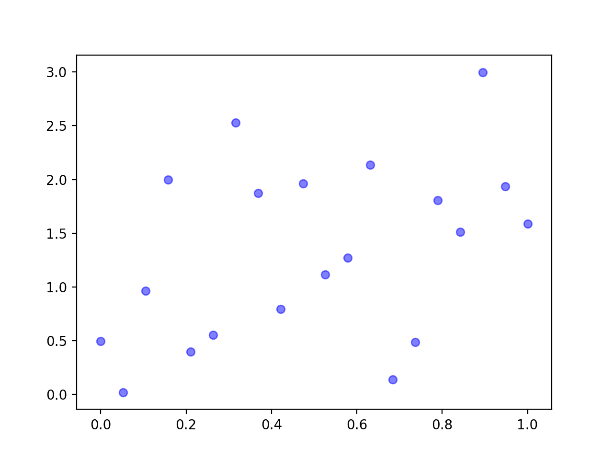
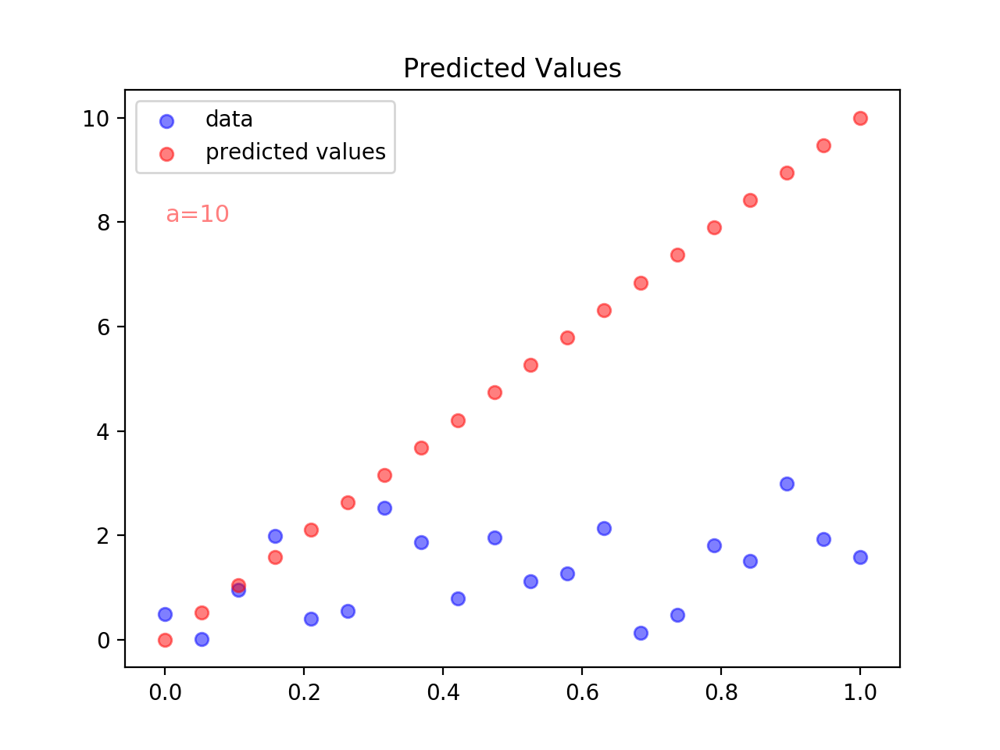
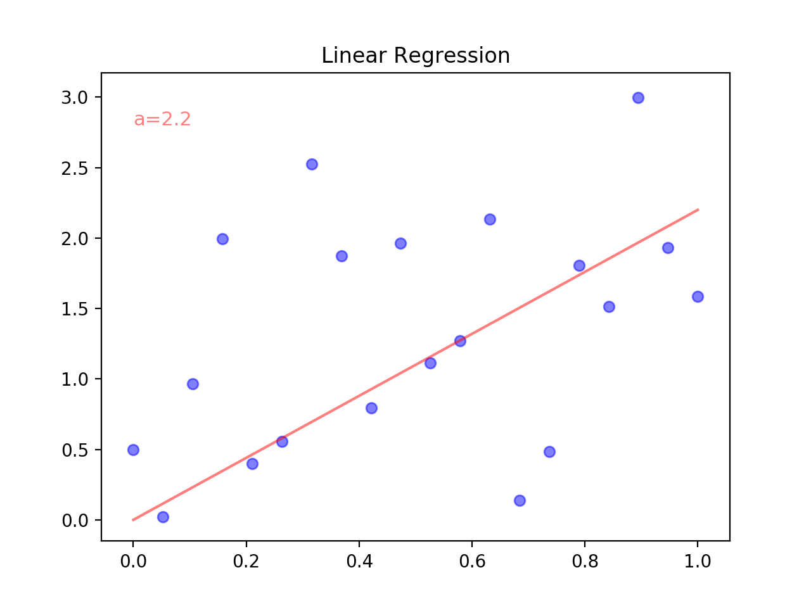

# Data Science Assessment - SPICED Academy

This is an an [assessment task](./Data-Science-Assessment-Task.pdf) done for the Data Science Course at [SPICED Academy](https://www.spiced-academy.com/program/data-science).

## Getting Started

Please execute the following commands from your terminal:

```
$ git clone git@github.com:OliverSieweke/data-science-assessment.git
$ cd data-science-assessment
$ pip install -r requirements.txt
```

To run all tasks in sequence, log the results and show the final plot:
```
$ python3 main.py
```

## Task 1

The data can be retrieved by invoking the `data_points()` function from `data_points.py` which returns an iterator yielding the x, y data points.



## Task 2

The predicted values can be retrieved through the `predicted_values(coefficient, data)` function from `predicted_values.py`.




The predicted values with coefficient `a=10` for the provided data points are:
```
0.0
0.5263157894736842
1.0526315789473684
1.5789473684210527
2.1052631578947367
2.631578947368421
3.1578947368421053
3.6842105263157894
4.2105263157894735
4.7368421052631575
5.263157894736842
5.7894736842105265
6.315789473684211
6.842105263157894
7.368421052631579
7.894736842105264
8.421052631578947
8.94736842105263
9.473684210526315
10.0
```


## Task 3

The MSE is calculated through the `calculate_mse(coefficient, data)` function from `calculate_mse.py`.

The MSE for coefficient `a=10` is: `21.306499419071013`


## Task 4

The regression coefficient is estimated with the `estimate_coefficient(data, start_coefficient, iterations, increment)` function from `estimate_coefficient.py`.



The estimated regression coefficient with the provided procedure is `2.2`, the corresponding MSE is `0.71`.


## Task 5

Below are some suggestions that could improve the algorithm:
- **Accuracy**: there is currently no guarantee that the algorithm will converge to an accurate estimate. Indeed if the correct regression coefficient is inferior to the provided starting value, the current procedure will simply return that starting value. To avoid this issue, the increment of `0.1` could be transformed to a negative `-0.1` increment when the MSE is not improved.
- **Precision**: the coefficient increment of `0.1` at each iteration could be halved every time a point is reached where the MSE is not improved. In combination with the above improvement, the estimation could become arbitrarily precise, given a suitable number of iterations.
- **Speed**: with large regression coefficients the current constant increment of `0.1` could require a lot of iterations before reaching a precise estimate. The increment could be determined dynamically based on the evolution of the previous MSE calculations (choosing larger increments when there are large improvements between two subsequent MSE calculations and vice versa).
